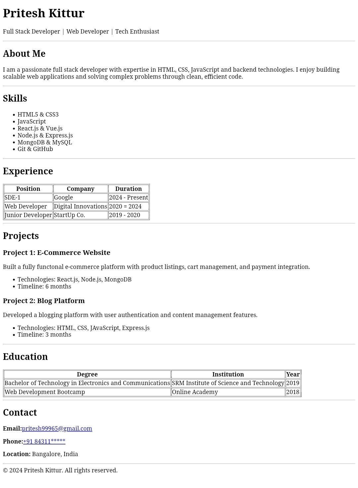

# HTML Resume Page

A single-page resume website built using **pure HTML5** as part of the Web Dev Cohort 2026.  
This project focuses on understanding **semantic HTML structure**, content organization, and clean layout without using CSS or JavaScript.

---

## Live Demo

https://html-resume-onepage-assignment.vercel.app/

---

## Project Overview

This project demonstrates how a professional resume can be created using only HTML by applying:
- Semantic elements
- Tables for structured data
- Lists for skills and projects
- Accessible and readable markup

---

## Features

- Semantic HTML5 layout
- Professional resume structure
- Tables for experience and education
- Lists for skills and projects
- Clickable contact information
- No CSS or JavaScript used

---

## Tech Stack

- HTML5

---

## Setup & Usage

1. Clone the repository:
   ```bash
   git clone https://github.com/priteshkittur/HTML-Resume-onepage-assignment
2. Open Code Files in your VS Code
3. Install Live Server extension by Ritwick Dey or any other live preview extension of your choice
4. Click on Go Live at bottom of your Screen and the preview will open in your Default Browser

---

## Preview
<p align="center">
   
</p>   
